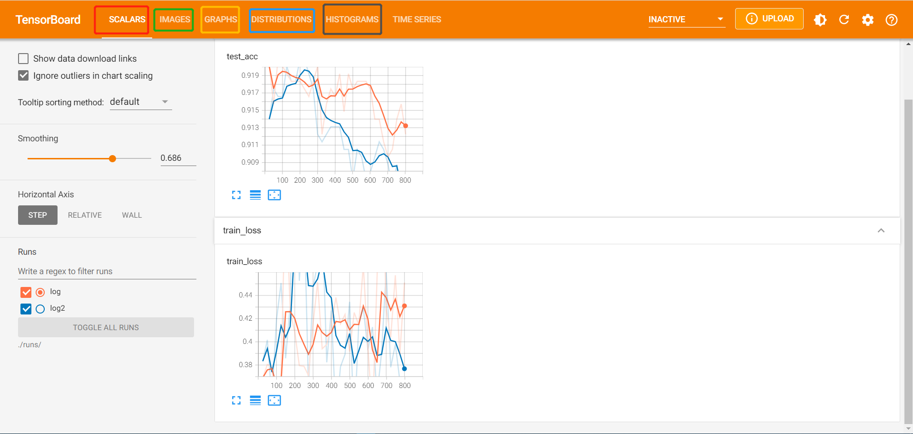

## `tensorboardX 工具`

* tensorboardX 是帮助 PyTorch 使用Tensorboard 进行可视化的一个工具。 

### `一、tensorboardX 常用的功能和调用方式：`

* `SummaryWriter`：创建编写器，保存日志 
  
        writer = SummaryWriter()

* `writer.add_scalar()`：添加标量 

        writer.add_scalar('tag',value,iteration)

        tag：           图像的标签名，图的唯一标识
        scalar_value：  要记录的标量，y 轴的数据
        global_step：   x 轴的数据

* `writer.add_image()`：添加图像 

        writer.add_image('imresult',x,iteration)

        功能：记录图像
        tag：           图像的标签名，图像的唯一标识
        img_tensor：    图像数据，需要注意尺度
        global_step：   记录这是第几个子图
        dataformats：   数据形式，取值有'CHW'，'HWC'，'HW'。如果像素值在 [0, 1] 之间，那么默认会乘以 255，放大到 [0, 255] 范围之间。
                        如果有大于 1 的像素值，认为已经是 [0, 255] 范围，那么就不会放大。

        得到图中界面的 IMAGES

* `writer.add_histogram()`：添加直方图 

        writer.add_histogram('hist',arrary,iteration)

        功能：          统计直方图与多分位折线图
        tag：           图像的标签名，图的唯一标识
        values：        要统计的参数，通常统计权值、偏置或者梯度
        global_step：   第几个子图
        bins：          取直方图的 bins

        除了得到界面中的 HISTOGRAMS 还能得到 DISTRIBUTIONS

* `writer.add_graph()`：添加网络结构 

        writer.add_graph('model',input_to_model=None)

        功能：              可视化模型计算图
        model：             模型，必须继承自 nn.Module
        input_to_model：    输入给模型的数据，形状为 BCHW
        verbose：           是否打印图结构信息

* `writer.add_audio()`：添加音频 

        writer.add_graph(tag,audio,iteration,sample_rate)

* `writer.add_text()`：添加文本 
  
        writer.add_text(tag,text_string,global_step=None)

### `关于上述方法的扩展补充：`

* 对于 `add_images` 方法来说：虽然可以通过拖动显示每张图片，但实际中我们希望在网格中同时展示多张图片，可以用到 `make_grid()` 函数。

* `1、add_images + torchvision.utils.make_grid`：`torchvision.utils.make_grid` 用于制作网格图像

        torchvision.utils.make_grid(tensor, nrow, padding, normalize, range, scale_each, pad_value)

    
    * tensor：    图像数据，$B \times C \times H \times W$的形状
    
    * nrow：      行数(列数是自动计算的，为：$\frac{B}{nrow}$)

    * padding：   图像间距，单位是像素，默认为 2

    * normalize： 是否将像素值标准化到 [0, 255] 之间

    * range：     标准化范围，例如原图的像素值范围是 [-1000, 2000]，设置 range 为 [-600, 500]，那么会把小于 -600 的像素值变为 -600，那么会把大于 500 的像素值变为 500，然后标准化到 [0, 255] 之间

    * scale_each：是否单张图维度标准化

    * pad_value： 间隔的像素值

* 模型计算图的可视化还是比较复杂，不够清晰。而torchsummary能够查看模型的输入和输出的形状，可以更加清楚地输出模型的结构。

* `2、torchsummary`： 功能：查看模型的信息，便于调试

        torchsummary.summary(model, input_size, batch_size=-1, device="cuda")

        功能：          查看模型的信息，便于调试
        model：         pytorch 模型，必须继承自 nn.Module
        input_size：    模型输入 size，形状为 CHW
        batch_size：    batch_size，默认为 -1，在展示模型每层输出的形状时显示的 batch_size
        device：        "cuda"或者"cpu"

    用法：

        # 模型
        lenet = LeNet(classes=2)
        print(summary(lenet, (3, 32, 32), device="cpu"))

## `二、PyTorch 调用 tensorboardX 的案例：`

其中 dnnc 是已经创建好的 dnn 分类模型：

`启动 tensorboard 的方法：`进入到日志目录的父目录中使用：

    tensorboard --logdir="./runs/"   ## runs 为 log 所在父目录名称

`建议：`在创建编写器时最好指定两层目录，比如下面的 runs/log 在启动 tensorboard 时打开父目录，之后保存第二个编写器的日志时，就可以在tensorboard中查看到 runs 目录下所有存在的日志了。

    ## 创建编写器，保存日志
    SumWriter = SummaryWriter(log_dir='./runs/log')
    ## 优化器
    optimizer = torch.optim.Adam(dnnc.parameters(),lr=0.01)
    loss_func = nn.CrossEntropyLoss()
    ## 定义训练过程损失指标
    history1 = hl.History()
    ## 使用 Canvas 可视化损失
    canvas1 = hl.Canvas()
    print_steps = 25

    for epoch in range(15):
        ## 对训练数据的加载器进行迭代计算
        for step,(b_x,b_y) in enumerate(train_loader): ## 每一次迭代会使用 DataLoader 指定的批处理大小的数据
            _,_,output = dnnc(b_x)                      ## DNN 的输出
            train_loss= loss_func(output,b_y)           ## 使用二分类交叉熵损失函数计算损失
            optimizer.zero_grad()                       ## 初始化梯度为0
            train_loss.backward()                       ## 损失的反向传播，计算梯度
            optimizer.step()                            ## 使用梯度进行优化，更新网络参数
            niter = epoch*len(train_loader) + step +1
            
            ## 计算每经过print_step 次迭代后的输出
            if niter % print_steps == 0:
                ## 为日志添加训练集损失函数
                SumWriter.add_scalar('train loss',train_loss.item(),global_step = niter)
                _,_,output = dnnc(X_test_s)
                _,pre_lab = torch.max(output,1)
                test_accuracy = accuracy_score(y_test_t,pre_lab)
                ## 为日志添加在测试集上的预测精度
                SumWriter.add_scalar('test acc',test_accuracy.item(),niter)

                ## 为日志日添加训练数据的可视化图像，使用当前batch的图像   <-- 如果处理的不是图片数据不需要进行add_image 这个方法差不多就是展示可视化图像的
                ## 将一个batch的数据进行预处理
                b_x_im = vutils.make_grid(b_x,nrow=12)
                SumWriter.add_image('train image sample',b_x_im,niter)
                
                ## 使用直方图可視化网络中参数的分布情况
                for name,param in dnnc.named_parameters():
                    SumWriter.add_histogram(name,param.data.numpy(),niter)
                    

    SumWriter.close()  ## 不 close ，数据不会保存

## `三、tensorboard 中的选项 - Scalar 界面`

* `Show data download links` 可以展示每个图的下载按钮，如果一个图中有多个数据，需要选中需要下载的曲线，然后下载，格式有 `csv` 和 `json` 可选。

* `Ignore outliers in chart scaling` 可以设置是否忽略离群点

* `Soothing` 是对图像进行平滑, `Smoothing` 设置为 0，没有进行平滑.

* `Horizontal Axis` `表示横轴：STEP` 表示原始数据作为横轴， `RELATIVE` 和 `WALL` ``都是以时间作为横轴，单位是小时，RELATIVE` 是相对时间，WALL` 是绝对时间。

