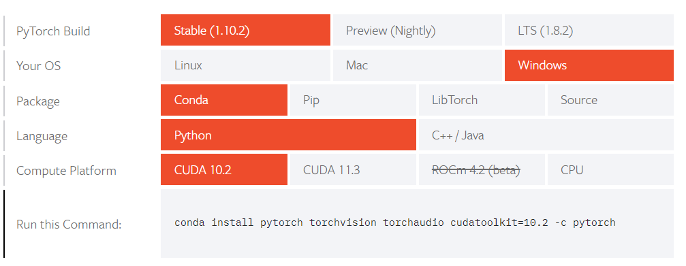

# Pytorch 的安装

* `1、`安装 `Anaconda`

* `2、`打开 `cmd` 窗口，运行 `conda config` ，此时在 `/user/用户名字/` 目录下会生成一个 `.condarc` 文件，接下来修改文件中的镜像源，[北京外国语大学开源软件镜像站](https://mirrors.bfsu.edu.cn/help/anaconda/) 。

    配置如下：

        channels:
        - defaults
        show_channel_urls: true
        default_channels:
        - https://mirrors.bfsu.edu.cn/anaconda/pkgs/main
        - https://mirrors.bfsu.edu.cn/anaconda/pkgs/r
        - https://mirrors.bfsu.edu.cn/anaconda/pkgs/msys2
        custom_channels:
        conda-forge: https://mirrors.bfsu.edu.cn/anaconda/cloud
        msys2: https://mirrors.bfsu.edu.cn/anaconda/cloud
        bioconda: https://mirrors.bfsu.edu.cn/anaconda/cloud
        menpo: https://mirrors.bfsu.edu.cn/anaconda/cloud
        pytorch: https://mirrors.bfsu.edu.cn/anaconda/cloud
        pytorch-lts: https://mirrors.bfsu.edu.cn/anaconda/cloud
        simpleitk: https://mirrors.bfsu.edu.cn/anaconda/cloud

    然后运行：`conda clean -i` 清除索引缓存，保证用的是镜像站提供的索引。

* `3、`下载 `pytorch` 和 `nb_conda` (可以用它来切换 `kernel` )：下载 `pytorch` 用官网的命令，否则下载的 `pytorch` 可能不支持 `gpu` 功能。

    `pytorch：`

        conda install pytorch torchvision torchaudio cudatoolkit=10.2 -c pytorch

    

    `nb_conda：`

        conda install nb_conda 

* `4、`[创建 conda 虚拟环境，案例如下：](http://zllbook.tudouwa.fun/Python%E5%AE%9E%E6%88%98/Python%E5%9F%BA%E7%A1%80/Python%E5%8C%85%E7%AE%A1%E7%90%86%E5%8F%8A%E8%99%9A%E6%8B%9F%E7%8E%AF%E5%A2%83%E7%AE%A1%E7%90%86.html)

      1. 显示所有的虚拟环境：conda env list
          （注意目录：base 在基目录，其它后天的环境在 envs 内[C:\anaconda3\envs]）
          
      2. 创建一个名为 zlltest 环境，指定Python版本是3.8或2.7
          conda create --name zlltest python=3.8
          conda create --name zlltest python=3.7.1 --channel https://mirrors.tuna.tsinghua.edu.cn/anaconda/pkgs/free/

      3. 激活名为 zlltest 的环境
          conda activate zlltest  # windows
          source activate zlltest # linux/mac

      4. 切换环境
          conda activate zlltest

      5. 退出环境
          deactivate   #windows
          source deactivate #linux

      6. 删除一个名为 zlltest 的环境
          conda remove --name zlltest --all

      7. 克隆oldname环境为newname环境

* `5、`开启虚拟环境，启动 `jupyter notebook` 

* `6、`安装所需要的包，使用 `-n指定环境` 安装：
  
        conda install -n zlltest numpy # 在名为 zlltest 环境下安装 numpy 包

    这个时候 `conda` 的 `base` 环境自己会先安装相应的包，然后将这个包复制到相应的虚拟环境中。

    不过在安装的时候，会出现有一些包在你配置的镜像中找不到的情况，这个时候就需要用 `pip` 安装。
    
    但是在使用 `pip` 安装的时候需要注意，此时的 `pip` 命令是 `base` 环境下的 `pip` ，下载的包会装在 `base` 里(对全局环境和当前虚拟环境都有效)，如果想避免这样的情况(实现隔离)，你需要在激活进入虚拟环境时，使用 [conda install pip](用conda和pip隔离Python环境) ，来给虚拟环境分配他自己环境的 `pip`

## `二、canda 、 conda 和 pip 之间的关系： `

* canda 有 base 环境和 虚拟环境，在虚拟环境下用 conda 安装

* `pip` 和 `conda` 都是管理包的工具，使用 `conda` 的好处在于其直接支持虚拟环境的创建，但是 `pip` 不支持， `pip` 需要借助 `virtualenv` 创建虚拟环境。

### `1、conda 和 pip 安装库的区别：`

* 在 `Anaconda` 中，无论在哪个环境下，只要通过 `conda install xxx` 的方式安装的库都会放在 `Anaconda` 的 `pkgs` 目录下，如: `E:\python\anaconda\pkgs\numpy-1.18.1-py36h48dd78f_1` 。这样的好处就是，当在某个环境下已经下载好了某个库，再在另一个环境中还需要这个库时，就可以直接从 `pkgs` 目录下将该库复制至新环境（将这个库的 `Lib\site-packages` 中的文件复制到当前新环境下 `Lib` 中的第三方库中，也即 `Lib\site-packages 中，这个过程相当于通过 `pip install xxx` 进行了安装）而不用重复下载。

### `2、conda 和 pip 卸载库的区别:`

* `pip` 是在特定的环境中进行库的安装，所以卸载库也是一样的道理，通过 `pip uninstall xxx` 就可以将该环境下`Lib\site-packages` 中对应的库进行卸载了。

* 如果通过 `conda uninstall xxx` 删除当前环境下某个库时，删除的只是当前环境下 `site-packages` 目录中该库的内容，它的效果和通过 `pip uninstall xxx` 是一样的。如果再到另一个环境中通过 `conda install xxx` 下载这个库，则还是通过将`pkgs`目录下的库复制到当前环境。若要清空这个 `pkgs` 下的已下载库，可以通过命令 `conda clean -h` 进行实现。

## `三、conda clean 命令：` 

* `Conda clean 净化Anaconda：`https://www.jianshu.com/p/f14ac62bef99

## `四、一些报错的解决：`

* `问题一：` 出现 `OSError: [WinError 193] %1 不是有效的 Win32 应用程序`
  
    `解决方法：`解决方法是删除掉 `pip` 安装路径的 `python` 文件夹，一般在 `C:\Users\admin\AppData\Roaming\Python`

