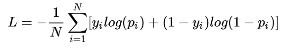
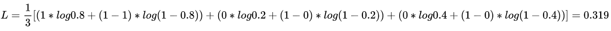
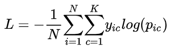
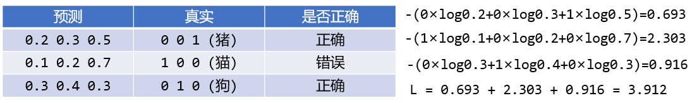

# `nn 损失函数`

### `1、nn.BCELoss`

* `二分类交叉熵`：

  

其中，$N$ 是总样本数，$y_i$ 是第 $i$ 个样本的所属类别，$p_i$ 是第 $i$ 个样本的预测值，一般来说，它是一个概率值。

| $y_i$ | $p_i$ |
| ----- | ----- |
| 1     | 0.8   |
| 0     | 0.2   |
| 0     | 0.4   |

  

### `2、BCEWithLogitsLoss`

* `sigmoid` + `二分类交叉熵` 的组合：

  

  

### `3、CrossEntropyLoss`

* `nn.LogSoftmax() + nn.NLLLoss()` 的组合，`nn.NLLLoss()` 为负对数似然函数，也就是交叉熵损失。
  
*  此时在神经网络的最后一层不需要在定义 softmax 层了。

