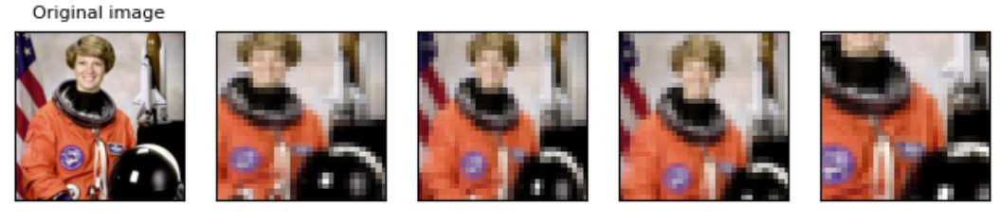
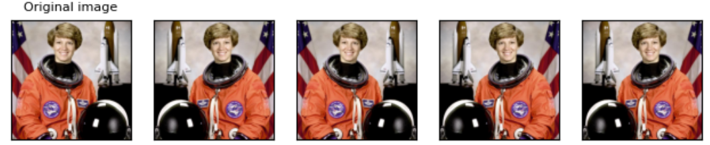

# `transforms 模块`

`图像预处理模块` —— `transforms`：常用的图像操作，如 `随机切割`、`旋转`、`数据类型转换`、`tensor` 与 `numpy` 和 `PIL` `Image` 的互换等。

`加载模块：`

    from torchvision import transforms

## 1、transforms.ToTensor： 

* `ToTensor()` 将 `shape` 为 `(H, W, C)` 的 `numpy.ndarray` 或 `img` 转为 `shape` 为 `(C, H, W)` 的 `tensor` ，归一化至 `[0,1] ` 是直接除以 `255` ，每个像素变成一个 `32` 位的浮点类型。

## 2、transforms.Normalize： 

* 公式：$\frac{(x-mean)}{std}$ 

* `功能：`逐 `channel` 的对图像进行 `标准化`。

        transforms.Normalize(
            mean,
            std,
            inplace=False
        )

    `主要参数：`

        mean：      各通道的均值。
        std：       各通道的标准差。
        inplace：   是否原地操作。

    在自己训练模型的时候可以自己计算数据集中的 `mean` 和 `std` ，也可以使用 `ImageNet` 数据集的 `mean` 和 `std` ：

        transforms.Normalize([0.485, 0.456, 0.406], [0.229, 0.224, 0.225])

## 3、transforms.Compose： 

* `Composes several transforms together ：Composes` 可以将多个变换组合在一起。

    `案例：`

        transforms.Compose([
            transforms.CenterCrop(10),
            transforms.PILToTensor(),
            transforms.ConvertImageDtype(torch.float),
            ])

## 4、transforms.RandomResizedCrop： 

* 在随机位置裁剪图像，然后将裁剪的大小调整为给定大小。

    可以放在 `transforms.Compose` 中，也可以单独对图像进行调整：

        transforms.RandomResizedCrop(32)(img) ## 第一个参数是调整的图像大小，第二个参数是调整的图片。

    

    会模糊的原因是图片裁剪的太小了，裁到了32。

## 5、transforms.RandomHorizontalFlip 

* 对图像进行一定概率的随机水平翻转，默认概率为0.5。

        transforms.RandomHorizontalFlip (0.5)(img) ## img 为图片

    

## `参考：`

* `transform 的变换示例，ILLUSTRATION OF TRANSFORMS：`https://pytorch.org/vision/stable/auto_examples/plot_transforms.html#centercrop

